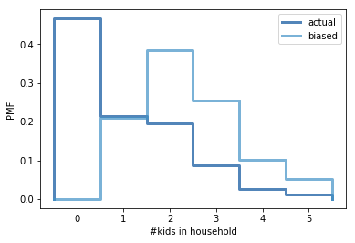

[Think Stats Chapter 3 Exercise 1](http://greenteapress.com/thinkstats2/html/thinkstats2004.html#toc31) (actual vs. biased)

>> The actual mean number of kids under 18 in the household is 1, whereas the biased mean is 2.4
>>
>> 

