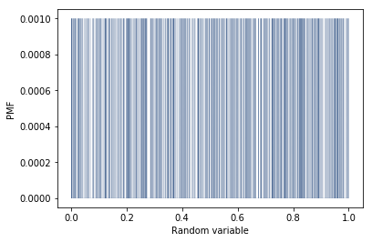
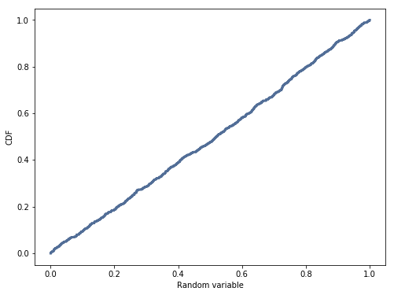

[Think Stats Chapter 4 Exercise 2](http://greenteapress.com/thinkstats2/html/thinkstats2005.html#toc41) (a random distribution)

>>  
>>
>>  
>>
>> The PMF is constant for all values of the random variable and the CDF is a straight line, hence the distribution is Uniform
